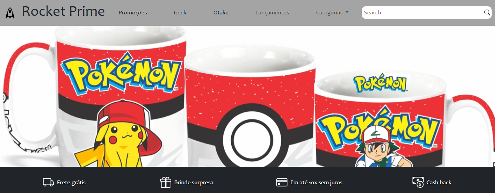

# Rocket Prime - Loja de Produtos Nerd 🚀👾🎮

Este é o repositório oficial da Rocket Prime, uma loja online que oferece uma variedade de produtos relacionados à cultura geek e nerd, como camisetas, moletons, canecas e miniaturas de personagens de anime, mangá, quadrinhos e muito mais. 🛍️🎉

## Visão Geral 🌟

O Rocket Prime é uma plataforma de e-commerce desenvolvida para atender às necessidades dos fãs de cultura pop. Nossa loja oferece uma ampla gama de produtos relacionados a animes, mangás e quadrinhos.

## Tecnologias Utilizadas 💻🔧

- HTML5
- CSS3
- Bootstrap 5.3.1
- JavaScript

## Como Contribuir 🤝🌟

Nós adoraríamos receber suas contribuições para aprimorar o Rocket Prime! Sinta-se à vontade para abrir pull requests com novos recursos, correções de bugs ou melhorias no design.

1. Faça um fork deste repositório. 🍴
2. Crie uma nova branch com uma descrição clara do que você está contribuindo (`git checkout -b sua-contribuicao`).
3. Faça suas modificações e commit (`git commit -m 'Adicione sua mensagem aqui'`).
4. Push para a branch (`git push origin sua-contribuicao`).
5. Abra um pull request para nossa branch principal.

Acesse o projeto em:
https://yomarcos.github.io/lojaRocketPrime/
